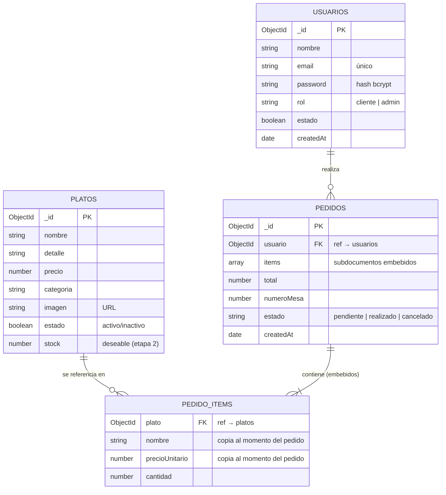

# 🗄️ Esquema de base de datos — La Comanda

Base de datos **documental (NoSQL)** gestionada con **MongoDB Atlas** y modelada desde el backend con **Mongoose**.

El diseño sigue los criterios de MongoDB: los datos que se leen juntos se embeben (los ítems dentro del pedido), y lo que es una entidad propia y reutilizable se referencia por `ObjectId` (el usuario dueño del pedido, el plato de origen de cada ítem).

---

## 📊 Diagrama de colecciones

> Las colecciones reales son **tres**: `usuarios`, `platos` y `pedidos`. `PEDIDO_ITEMS` no es una colección aparte: representa los subdocumentos **embebidos** dentro del array `items` de cada pedido.

---

## 📁 Colección `usuarios`

| Campo                     | Tipo (Mongoose / BSON)            | Obligatorio | Descripción                                           |
| ------------------------- | --------------------------------- | ----------- | ----------------------------------------------------- |
| `_id`                     | ObjectId                          | sí (auto)   | Identificador único del documento                     |
| `nombre`                  | String                            | sí          | Nombre del usuario                                    |
| `email`                   | String                            | sí          | Correo electrónico. **Único** (índice unique)         |
| `password`                | String                            | sí          | Contraseña hasheada con bcrypt (nunca en texto plano) |
| `rol`                     | String (enum: `cliente`, `admin`) | sí          | Define permisos. Por defecto `cliente`                |
| `estado`                  | Boolean                           | sí          | Usuario activo / deshabilitado. Por defecto `true`    |
| `createdAt` / `updatedAt` | Date                              | sí (auto)   | Timestamps automáticos de Mongoose                    |

**Índices:** `email` único.

---

## 📁 Colección `platos`

| Campo                     | Tipo (Mongoose / BSON) | Obligatorio | Descripción                                                                                                                  |
| ------------------------- | ---------------------- | ----------- | ---------------------------------------------------------------------------------------------------------------------------- |
| `_id`                     | ObjectId               | sí (auto)   | Identificador único del documento                                                                                            |
| `nombre`                  | String                 | sí          | Nombre del plato                                                                                                             |
| `detalle`                 | String                 | no          | Descripción / ingredientes                                                                                                   |
| `precio`                  | Number                 | sí          | Precio actual del plato                                                                                                      |
| `categoria`               | String                 | sí          | Categoría (ej. entradas, principales, bebidas). En el MVP es un campo del plato; como colección propia queda para la etapa 2 |
| `imagen`                  | String                 | no          | URL de la imagen del plato                                                                                                   |
| `estado`                  | Boolean                | sí          | Activo / inactivo (visible u oculto en la carta). Por defecto `true`                                                         |
| `stock`                   | Number                 | no          | _(Deseable, etapa 2)_ Unidades disponibles; al llegar a 0 el plato figura «agotado»                                          |
| `createdAt` / `updatedAt` | Date                   | sí (auto)   | Timestamps automáticos                                                                                                       |

**Índices:** `categoria` (para filtrar la carta); `nombre` (búsqueda, etapa 2).

---

## 📁 Colección `pedidos`

| Campo                     | Tipo (Mongoose / BSON)                               | Obligatorio | Descripción                                            |
| ------------------------- | ---------------------------------------------------- | ----------- | ------------------------------------------------------ |
| `_id`                     | ObjectId                                             | sí (auto)   | Identificador único del documento                      |
| `usuario`                 | ObjectId (ref → `usuarios`)                          | sí          | Referencia al usuario que realizó el pedido            |
| `items`                   | Array de subdocumentos                               | sí          | Lista de platos pedidos (ver estructura abajo)         |
| `total`                   | Number                                               | sí          | Suma de `precioUnitario × cantidad` de todos los ítems |
| `numeroMesa`              | Number                                               | sí          | Mesa desde la que se realiza el pedido                 |
| `estado`                  | String (enum: `pendiente`, `realizado`, `cancelado`) | sí          | Estado del pedido. Por defecto `pendiente`             |
| `createdAt` / `updatedAt` | Date                                                 | sí (auto)   | Timestamps automáticos (fecha del pedido)              |

**Subdocumento de `items` (embebido):**

| Campo            | Tipo                      | Obligatorio | Descripción                                    |
| ---------------- | ------------------------- | ----------- | ---------------------------------------------- |
| `plato`          | ObjectId (ref → `platos`) | sí          | Referencia al plato de origen                  |
| `nombre`         | String                    | sí          | Copia del nombre del plato al momento de pedir |
| `precioUnitario` | Number                    | sí          | Copia del precio del plato al momento de pedir |
| `cantidad`       | Number                    | sí          | Cantidad pedida de ese plato                   |

**Índices:** `usuario` (para listar «mis pedidos»); `estado` (para filtrar en el panel admin).

---

## 🔗 Relaciones y decisiones de diseño

- **`pedidos.usuario` → `usuarios._id`** (referencia): un usuario puede tener muchos pedidos; cada pedido pertenece a un único usuario.
- **`items.plato` → `platos._id`** (referencia): permite rastrear de qué plato salió cada ítem.
- **`items` embebidos dentro de `pedidos`:** los ítems se leen y se escriben siempre junto con el pedido, por eso se embeben en lugar de usar una colección aparte.
- **Snapshot de nombre y precio:** cada ítem guarda una copia del `nombre` y el `precioUnitario` del plato al momento del pedido. Así, si luego cambia el precio o el nombre del plato, los pedidos históricos siguen mostrando lo que realmente se cobró.

---

_Documento de la 2.ª entrega (Diseño y Módulos) — La Comanda · TUPaD · UTN._
